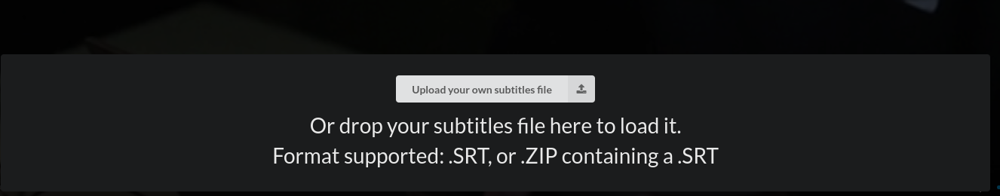

# Hackad Finnish Translation

The "Hackad" ethical hacking series has been translated into Finnish to provide an alternative for users, as the default translation is only available in Swedish.

Watch Hackad at: https://www.svtplay.se/video/32893243/hackad/hackad-sasong-1-jag-har-inget-att-dolja?info=visa
# INSTALLATION

To install this plugin:
### Chrome

https://chrome.google.com/webstore/detail/substital-add-subtitles-t/kkkbiiikppgjdiebcabomlbidfodipjg?hl=en
### Firefox

https://addons.mozilla.org/en-US/firefox/addon/substital/
# Using Substital

1. At the start of your episode, navigate to the "Extensions" menu located in the top-right corner of your browser.
2. Choose "Substital" from the menu.
3. Select the appropriate translated .srt file from the menu displayed at the bottom of your screen.
4. Once selected, you're all set to enjoy the translated subtitles.

